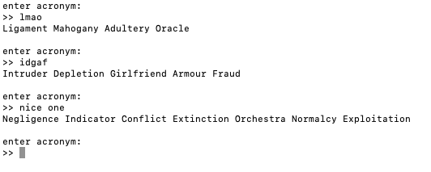

# reverse acronym

i made this to procrastinate doing real hw bc my friend tweeting a bunch of random characters
and i thought it would be funny if it was an acronym

i used nouns.json from darius kazemi's [corpora](https://github.com/dariusk/corpora)

## example

